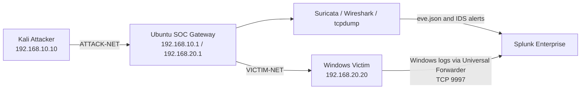

# SOC Network & Endpoint Detection Lab

A three-VM cybersecurity home lab built in VirtualBox to simulate, detect, and investigate a multi-stage attack against a Windows endpoint using **Splunk Enterprise, Suricata, Sysmon, PowerShell logging, Wireshark, and tcpdump**.

> This project was created for defensive-security learning in an isolated home-lab environment. All systems, accounts, files, and traffic are lab-only.

---

## Navigation

- [Project Overview](#project-overview)
- [Architecture](#architecture)
- [Network Segments](#network-segments)
- [Lab Systems](#lab-systems)
- [Data Sources Ingested into Splunk](#data-sources-ingested-into-splunk)
- [Controlled Attack Flow](#controlled-attack-flow)
- [Detection Summary](#detection-summary)
- [Splunk Detection Queries](#splunk-detection-queries)
- [MITRE ATT&CK Mapping](#mitre-attck-mapping)
- [Skills Demonstrated](#skills-demonstrated)
- [Repository Structure](#repository-structure)
- [Disclaimer](#disclaimer)

---

## Project Overview

The lab separates the attacker and victim into different internal networks. An Ubuntu SOC gateway routes traffic between them, allowing Suricata and packet-analysis tools to inspect attacker-to-victim communications.

Windows endpoint telemetry is forwarded to Splunk Enterprise through the Splunk Universal Forwarder and correlated with Suricata network events.

The completed simulation covers:

- Network reconnaissance
- Failed RDP authentication attempts
- Successful RDP access
- System and account discovery
- Suspicious PowerShell execution
- Scheduled-task persistence
- Fake-data collection and archiving
- Simulated HTTP command-and-control-style beaconing
- Controlled outbound transfer of dummy data

A detailed investigation is documented in [`incident-report.md`](incident-report.md).

---

## Architecture



### Network Segments

| Segment | Purpose | Systems |
|---|---|---|
| `ATTACK-NET` | Attacker-side network | Kali `192.168.10.10`, Ubuntu `192.168.10.1` |
| `VICTIM-NET` | Victim-side network | Ubuntu `192.168.20.1`, Windows `192.168.20.20` |
| NAT | Internet and package access | All VMs |

Ubuntu IP forwarding is enabled so Kali-to-Windows traffic passes through the SOC gateway.

---

## Lab Systems

### Kali Attacker

- **Operating system:** Kali Linux
- **Hostname:** `kali-attacker`
- **Internal IP:** `192.168.10.10/24`
- **Purpose:** Controlled reconnaissance, authentication testing, RDP access, HTTP beacon simulation, and dummy-data transfer

### Windows Victim

- **Operating system:** Windows 10 Pro
- **Hostname:** `DESKTOP-17JMLSF`
- **Internal IP:** `192.168.20.20/24`
- **Installed telemetry:**
  - Sysmon
  - Splunk Universal Forwarder
  - Windows Security logs
  - Windows System logs
  - Windows Application logs
  - PowerShell Operational logs
  - PowerShell Script Block Logging
  - Microsoft Defender Operational logs

### Ubuntu SOC Gateway

- **Operating system:** Ubuntu Desktop 24.04 LTS
- **ATTACK-NET interface:** `enp0s8 — 192.168.10.1/24`
- **VICTIM-NET interface:** `enp0s9 — 192.168.20.1/24`
- **Installed tools:**
  - Splunk Enterprise
  - Suricata IDS
  - Wireshark
  - tcpdump
  - jq

---

## Data Sources Ingested into Splunk

| Data source | Purpose | Status |
|---|---|---:|
| Suricata `eve.json` | Network flows, protocol metadata, and IDS alerts | Working |
| Windows Security | Authentication and RDP activity | Working |
| Windows System | Operating-system and service events | Working |
| Windows Application | Application events | Working |
| Sysmon Operational | Process creation, command lines, and parent-child relationships | Working |
| PowerShell Operational | Script Block Logging and PowerShell activity | Working |
| Microsoft Defender Operational | Endpoint security events | Working |

The Windows Universal Forwarder sends endpoint events to Splunk over TCP port `9997`.

---

## Controlled Attack Flow

```text
Nmap reconnaissance
        ↓
Failed RDP logins
        ↓
Successful RDP login
        ↓
System and account discovery
        ↓
PowerShell execution-policy bypass
        ↓
Harmless PowerShell payload execution
        ↓
Scheduled-task persistence simulation
        ↓
Fake-document collection
        ↓
ZIP archive creation
        ↓
C2-style HTTP beacon
        ↓
Controlled outbound dummy-data transfer
```

> The evidence was generated across controlled lab sessions and should not be interpreted as a real-world compromise.

---

## Detection Summary

| Stage | Evidence source | Key evidence |
|---|---|---|
| Reconnaissance | Suricata | Kali connections to ports `135`, `139`, `445`, `3389`, and `5985` |
| Failed authentication | Windows Security | Event ID `4625`, source `192.168.10.10` |
| Successful RDP access | Windows Security | Event ID `4624`, Logon Type `10` |
| Discovery | Sysmon / PowerShell | `whoami`, `hostname`, `ipconfig`, `Get-LocalUser`, `Get-Process` |
| PowerShell execution | PowerShell Operational | Event ID `4104`, `ExecutionPolicy Bypass` |
| Persistence | PowerShell Operational | Scheduled-task creation and execution commands |
| Archive creation | PowerShell Operational | `Compress-Archive` and `collected-data.zip` |
| HTTP beacon | Suricata | Windows to Kali on TCP `8000` with a lab beacon URI |
| Dummy-data transfer | Suricata | Windows to Kali on TCP `9001`; `3,045` bytes sent |

---

## Splunk Detection Queries

### 1. Network Reconnaissance

```spl
source="/var/log/suricata/eve.json"
src_ip="192.168.10.10"
dest_ip="192.168.20.20"
dest_port IN (135,139,445,3389,5985)
| table _time event_type src_ip dest_ip dest_port proto app_proto alert.signature
| sort _time
```

### 2. Failed RDP Logins

```spl
index=* source="WinEventLog:Security" EventCode=4625
| eval User=coalesce(TargetUserName,Account_Name,user)
| eval SourceIP=coalesce(IpAddress,Source_Network_Address)
| search SourceIP="192.168.10.10" OR _raw="192.168.10.10"
| table _time User SourceIP Logon_Type Failure_Reason Status Sub_Status EventCode
| sort _time
```

### 3. Successful RDP Login

```spl
index=* source="WinEventLog:Security" EventCode=4624
| rex field=_raw "Logon Type:\s+(?<RDPLogonType>\d+)"
| rex field=_raw "Source Network Address:\s+(?<SourceIP>[^\r\n]+)"
| eval User=coalesce(TargetUserName,mvindex(Account_Name,-1),user)
| where RDPLogonType=10 AND SourceIP="192.168.10.10"
| table _time User SourceIP RDPLogonType EventCode
| sort _time
```

### 4. System and Account Discovery

```spl
index=* source="WinEventLog:Microsoft-Windows-Sysmon/Operational" EventCode=1
(CommandLine="*SOC-LAB-DISCOVERY*" OR
 CommandLine="*whoami*" OR
 CommandLine="*hostname*" OR
 CommandLine="*ipconfig*" OR
 CommandLine="*Get-LocalUser*" OR
 CommandLine="*Get-Process*")
| table _time User Image ParentImage CommandLine
| sort _time
```

### 5. Suspicious PowerShell Execution

```spl
index=* source="WinEventLog:Microsoft-Windows-PowerShell/Operational" EventCode=4104
| eval PowerShellCommand=coalesce(ScriptBlockText,Message,_raw)
| search PowerShellCommand="*SOC-LAB*" OR
         PowerShellCommand="*payload.ps1*" OR
         PowerShellCommand="*stage3.ps1*" OR
         PowerShellCommand="*ExecutionPolicy Bypass*"
| table _time host EventCode PowerShellCommand
| sort _time
```

### 6. Scheduled-Task Persistence

```spl
index=* source="WinEventLog:Microsoft-Windows-PowerShell/Operational" EventCode=4104
("New-ScheduledTaskAction" OR
 "New-ScheduledTaskTrigger" OR
 "Register-ScheduledTask" OR
 "Start-ScheduledTask")
| eval PSCommand=coalesce(ScriptBlockText,Message,_raw)
| rex max_match=0 field=PSCommand "(?<DetectedActions>New-ScheduledTaskAction|New-ScheduledTaskTrigger|Register-ScheduledTask|Start-ScheduledTask)"
| table _time host DetectedActions PSCommand
| sort _time
```

### 7. Fake-Data Collection and Archive Creation

```spl
index=* source="WinEventLog:Microsoft-Windows-PowerShell/Operational" EventCode=4104
("Compress-Archive" OR
 "collected-data.zip" OR
 "employee-data.txt" OR
 "server-notes.txt")
| eval PowerShellCommand=coalesce(ScriptBlockText,Message,_raw)
| table _time host EventCode PowerShellCommand
| sort _time
```

### 8. Simulated HTTP Beacon

```spl
source="/var/log/suricata/eve.json"
src_ip="192.168.20.20"
dest_ip="192.168.10.10"
dest_port=8000
| eval Stage="C2 / Outbound Connection Attempt"
| eval URI=coalesce('http.url',url)
| table _time Stage src_ip dest_ip dest_port proto event_type app_proto URI
| sort _time
```

### 9. Controlled Outbound Data Transfer

```spl
source="/var/log/suricata/eve.json"
event_type=flow
src_ip="192.168.20.20"
dest_ip="192.168.10.10"
dest_port=9001
| eval BytesSent=tonumber(coalesce('flow.bytes_toserver',bytes_toserver))
| eval BytesReceived=tonumber(coalesce('flow.bytes_toclient',bytes_toclient))
| eval PacketsSent=tonumber(coalesce('flow.pkts_toserver',pkts_toserver))
| eval TotalBytes=BytesSent+BytesReceived
| where BytesSent>0
| table _time src_ip src_port dest_ip dest_port proto PacketsSent BytesSent BytesReceived TotalBytes
| sort _time
```

**Confirmed result**

| Time | Source | Destination | Protocol | Packets Sent | Bytes Sent | Bytes Received | Total Bytes |
|---|---|---|---|---:|---:|---:|---:|
| 2026-08-02 15:44:06.953 | `192.168.20.20:61004` | `192.168.10.10:9001` | TCP | 6 | 3,045 | 186 | 3,231 |

> The flow confirms that data moved from Windows to Kali. Suricata flow metadata does not prove the exact file contents, so this is described as a **controlled outbound data transfer / simulated exfiltration**.

---

## MITRE ATT&CK Mapping

| Activity | Technique |
|---|---|
| Network port scan | T1046 — Network Service Scanning |
| Failed password attempts | T1110.001 — Password Guessing |
| RDP access | T1021.001 — Remote Desktop Protocol |
| Valid lab account use | T1078 — Valid Accounts |
| User discovery | T1033 — System Owner/User Discovery |
| Local-account discovery | T1087.001 — Local Account |
| Network-configuration discovery | T1016 — System Network Configuration Discovery |
| Process discovery | T1057 — Process Discovery |
| PowerShell execution | T1059.001 — PowerShell |
| Scheduled-task persistence | T1053.005 — Scheduled Task |
| Local fake-file collection | T1005 — Data from Local System |
| Archive creation | T1560.001 — Archive via Utility |
| HTTP beacon | T1071.001 — Web Protocols |
| Controlled outbound transfer | T1048 — Exfiltration Over Alternative Protocol |

> The MITRE mappings describe the intended behavior simulated in the lab. They do not indicate a real compromise.

---

## Skills Demonstrated

- SIEM monitoring and SPL development
- Windows Security Event Log analysis
- Sysmon process investigation
- PowerShell Script Block Logging analysis
- Suricata IDS and network-flow monitoring
- Packet validation with Wireshark and tcpdump
- RDP authentication investigation
- Cross-source event correlation
- Attack timeline reconstruction
- MITRE ATT&CK mapping
- Incident documentation and escalation

---

## Repository Structure

```text
soc-network-endpoint-detection-lab/
├── README.md
├── incident-report.md
├── detections/
│   ├── nmap-reconnaissance.spl
│   ├── failed-rdp-logins.spl
│   ├── successful-rdp-login.spl
│   ├── system-account-discovery.spl
│   ├── powershell-execution.spl
│   ├── scheduled-task-persistence.spl
│   ├── archive-creation.spl
│   ├── c2-http-beacon.spl
│   └── outbound-data-transfer.spl
├── screenshots/
└── diagrams/
    └── network-architecture.png
```

---

## Disclaimer

This repository documents a controlled cybersecurity home lab for educational and defensive-security purposes. All activity was performed on systems owned and isolated by the author.

Do not perform these tests against systems without explicit authorization.
