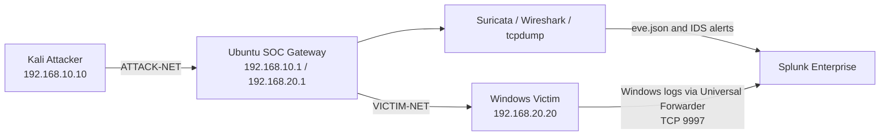

# SOC Network & Endpoint Detection Lab

A three-VM cybersecurity home lab built in VirtualBox to simulate, detect, and investigate a multi-stage attack against a Windows endpoint using **Splunk Enterprise, Suricata, Sysmon, PowerShell logging, and Wireshark**.

> This project was created for defensive-security learning in an isolated home-lab environment. All systems, accounts, files, and traffic are lab-only.

---

## Project Overview

The lab separates the attacker and victim into different internal networks. An Ubuntu SOC gateway routes traffic between them, allowing Suricata and packet-analysis tools to inspect attacker-to-victim communications. Windows endpoint telemetry is forwarded to Splunk and correlated with network events.

The completed simulation covers:

- Network reconnaissance
- Failed RDP authentication attempts
- Successful RDP access
- System and account discovery
- Suspicious PowerShell execution
- Scheduled-task persistence
- Fake-data collection and archiving
- Simulated HTTP command-and-control beaconing
- Controlled transfer of dummy data

---

## Architecture



### Network Segments

| Segment | Purpose | Systems |
|---|---|---|
| `ATTACK-NET` | Attacker-side network | Kali `192.168.10.10`, Ubuntu `192.168.10.1` |
| `VICTIM-NET` | Victim-side network | Ubuntu `192.168.20.1`, Windows `192.168.20.20` |
| NAT | Internet and package access | All VMs |

Ubuntu IP forwarding is enabled so Kali-to-Windows traffic passes through the SOC gateway.

---

## Lab Systems

### Kali Attacker

- **Operating system:** Kali Linux
- **Hostname:** `kali-attacker`
- **Internal IP:** `192.168.10.10/24`
- **Purpose:** controlled reconnaissance, authentication testing, RDP access, HTTP beacon simulation, and dummy-data transfer

### Windows Victim

- **Operating system:** Windows 10 Pro
- **Hostname:** `DESKTOP-17JMLSF`
- **Internal IP:** `192.168.20.20/24`
- **Installed telemetry:**
  - Sysmon
  - Splunk Universal Forwarder
  - Windows Security logs
  - Windows System logs
  - Windows Application logs
  - PowerShell Operational logs
  - PowerShell Script Block Logging
  - Microsoft Defender Operational logs

### Ubuntu SOC Gateway

- **Operating system:** Ubuntu Desktop 24.04 LTS
- **ATTACK-NET interface:** `enp0s8 — 192.168.10.1/24`
- **VICTIM-NET interface:** `enp0s9 — 192.168.20.1/24`
- **Installed tools:**
  - Splunk Enterprise
  - Suricata IDS
  - Wireshark
  - tcpdump
  - jq

---

## Data Sources Ingested into Splunk

| Data source | Purpose | Status |
|---|---|---:|
| Suricata `eve.json` | Network flows, protocol metadata, and IDS alerts | Working |
| Windows Security | Authentication and RDP activity | Working |
| Windows System | Operating-system and service events | Working |
| Windows Application | Application events | Working |
| Sysmon Operational | Process creation, command lines, and parent-child relationships | Working |
| PowerShell Operational | Script Block Logging and PowerShell activity | Working |
| Microsoft Defender Operational | Endpoint security events | Working |

The Windows Universal Forwarder sends events to Splunk over TCP port `9997`.

---

## Controlled Attack Flow

```text
Nmap reconnaissance
        ↓
Failed RDP logins
        ↓
Successful RDP login
        ↓
System and account discovery
        ↓
PowerShell execution-policy bypass
        ↓
Harmless PowerShell payload execution
        ↓
Scheduled-task persistence simulation
        ↓
Fake-document collection
        ↓
ZIP archive creation
        ↓
C2-style HTTP beacon
        ↓
Dummy-data transfer
```

### Detection Summary

| Stage | Evidence source | Key evidence |
|---|---|---|
| Reconnaissance | Suricata | Kali connections to ports `135`, `445`, `3389`, and `5985` |
| Failed authentication | Windows Security | Event ID `4625`, source `192.168.10.10` |
| Successful RDP access | Windows Security | Event ID `4624`, Logon Type `10` |
| Discovery | Sysmon / PowerShell | `whoami`, `hostname`, `ipconfig`, `Get-LocalUser`, `Get-Process` |
| PowerShell execution | PowerShell Operational | Event ID `4104`, `ExecutionPolicy Bypass` |
| Persistence | PowerShell Operational | Scheduled-task creation and execution commands |
| HTTP beacon | Suricata | Windows to Kali on TCP `8000` with a lab beacon URI |
| Dummy-data transfer | Suricata | Windows to Kali on TCP `9001` |

> The evidence was generated across multiple controlled lab sessions and should not be interpreted as one uninterrupted real-world incident.

---

## Example Detection Queries

### Failed RDP Logins

```spl
index=* source="WinEventLog:Security" EventCode=4625
| rex field=_raw "(?i)Source Network Address:\s+(?<SourceIP>[^\r\n]+)"
| table _time TargetUserName SourceIP Failure_Reason Status Sub_Status EventCode
| sort _time
```

### Successful RDP Login

```spl
index=* source="WinEventLog:Security" EventCode=4624
| rex field=_raw "(?i)Source Network Address:\s+(?<SourceIP>[^\r\n]+)"
| rex field=_raw "(?i)Logon Type:\s+(?<RDPLogonType>\d+)"
| search RDPLogonType=10
| eval User=coalesce(TargetUserName,Account_Name)
| table _time User SourceIP RDPLogonType EventCode
| sort _time
```

### Suspicious PowerShell Execution

```spl
index=* source="WinEventLog:Microsoft-Windows-PowerShell/Operational" EventCode=4104
("ExecutionPolicy Bypass" OR "payload.ps1" OR "stage3.ps1")
| eval PowerShellCommand=coalesce(ScriptBlockText,Message,_raw)
| table _time host EventCode PowerShellCommand
| sort _time
```

### Scheduled-Task Persistence

```spl
index=* source="WinEventLog:Microsoft-Windows-PowerShell/Operational" EventCode=4104
("New-ScheduledTaskAction" OR "New-ScheduledTaskTrigger" OR "Register-ScheduledTask" OR "Start-ScheduledTask")
| eval Action=coalesce(ScriptBlockText,Message,_raw)
| table _time host Action
| sort _time
```

### Simulated HTTP Beacon

```spl
source="/var/log/suricata/eve.json"
src_ip="192.168.20.20"
dest_ip="192.168.10.10"
dest_port=8000
| eval URI=coalesce('http.url',url)
| table _time event_type src_ip dest_ip dest_port proto app_proto URI
| sort _time
```

---

## MITRE ATT&CK Mapping

| Activity | Technique |
|---|---|
| Network port scan | T1046 — Network Service Scanning |
| Failed password attempts | T1110.001 — Password Guessing |
| RDP access | T1021.001 — Remote Desktop Protocol |
| Valid lab account use | T1078 — Valid Accounts |
| User discovery | T1033 — System Owner/User Discovery |
| Account discovery | T1087 — Account Discovery |
| Network configuration discovery | T1016 — System Network Configuration Discovery |
| Process discovery | T1057 — Process Discovery |
| PowerShell execution | T1059.001 — PowerShell |
| Scheduled-task persistence | T1053.005 — Scheduled Task/Job |
| Local fake-file collection | T1005 — Data from Local System |
| Archive creation | T1560.001 — Archive Collected Data |
| HTTP beacon | T1071.001 — Web Protocols |
| Simulated outbound transfer | T1041 — Exfiltration Over C2 Channel |

---

## Skills Demonstrated

- SIEM monitoring and SPL development
- Windows Security Event Log analysis
- Sysmon process investigation
- PowerShell Script Block Logging analysis
- Suricata IDS monitoring
- Packet validation with Wireshark and tcpdump
- RDP authentication investigation
- Cross-source event correlation
- Attack timeline reconstruction
- MITRE ATT&CK mapping
- Incident documentation and escalation

---


## Disclaimer

This repository documents a controlled cybersecurity home lab for educational and defensive-security purposes. All activity was performed on systems owned and isolated by the author. Do not perform these tests against systems without explicit authorization.
